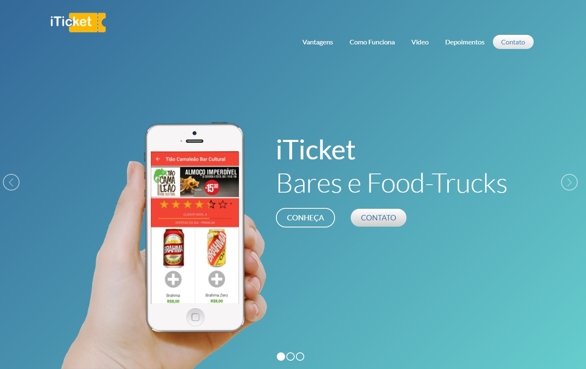

# iTicket #
* [www.iticket.me](https://www.facebook.com/iticket.me)

iTicket is a automation platform for pubs, food-trucks and general events that works with pre-order of products using tickets.

### Platform Modules ###

* iTicket-Server:
Server backend with resources, REST APIs, and administrative tools.
* iTicket-LandingPage:
Landing page with product details and comercial contacts.
* iTicket-Desktop:
Desktop application to manage tickets and transactions on client side.
* iTicket-UserApp:
Android/iOS mobile app to users buy tickets at establishments or events.
* iTicket-ClientApp:
Google Services, REST Retrofit.

### Stacks & Frameworks ###

* iTicket-Server:
Java-EE, JSF, MongoDB noSQL, RestEasy, JSON, WildFly.
* iTicket-LandingPage:
Java JSF, JavaScript, Html, Bootstrap e CSS.
* iTicket-Desktop:
Java-FX, MongoDB noSQL, QR-Code Gen, PrintManager, REST Retrofit.
* iTicket-UserApp:
Android/iOS mobile app to users buy tickets at establishments or events.
* iTicket-ClientApp:
Java, CouchBase noSQL, QR-Code Scan, REST Retrofit.

### Contribution guidelines ###

* This a public demonstration, forks and contributions are in another private repository.

### Contact ###

* [vinicius@iticket.me](mailto:vinicius@iticket.me)
